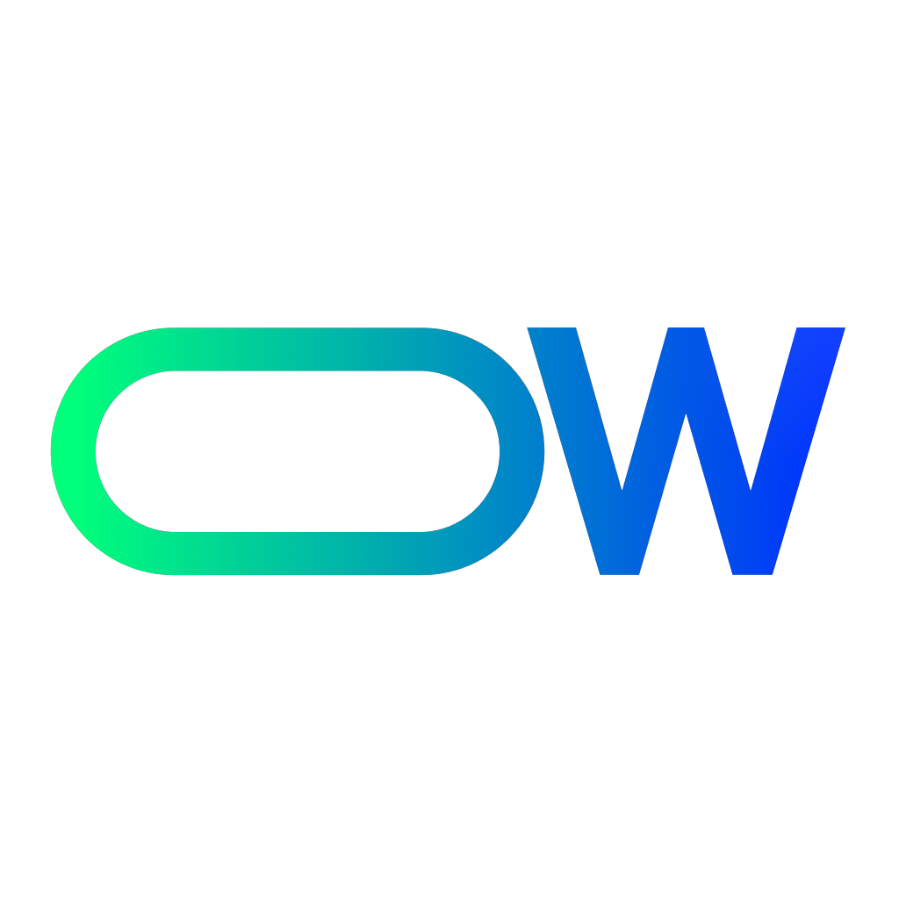

# [blog.wzero.dev](https://blog.wzero.dev)

### [(0w0i0n0g0.github.io)](https://0w0i0n0g0.github.io)

  

by_0w0i0n0g0

 
 

## Description

Welcome! 👋

This is my blog, hosted on Github Pages and built with Gatsby.

 
 

## Features

This blog is based on [zoomkoding-gatsby-blog](https://github.com/zoomkoding/zoomkoding-gatsby-blog).

Major new features and minor design changes are applied to this blog theme.

### Main Features

- Scroll Back to Top button.

- Like button with confetti.

- View and Like count with counter api.

- Highlighted Table of Contents synced to the line where you're reading with auto scrolling.

- Minor design changes.

 
 

## Stack

 

 
 

## License

Feel free to use on your own blog theme!

**The MIT License**

Read full license [here](https://github.com/0w0i0n0g0/0w0i0n0g0.github.io/blob/main/LICENSE).

**Third Party Notices**

- [zoomkoding-gatsby-blog](https://github.com/zoomkoding/zoomkoding-gatsby-blog)