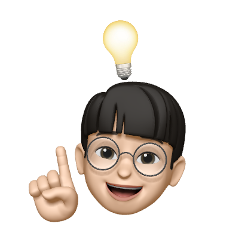

# [0w0i0n0g0.github.io](https://0w0i0n0g0.github.io/)

  

By_0w0i0n0g0

 
 

## Table of Contents

[Description](#description)

[Features](#features)

[Stack](#stack)

[License](#license)

 
 

## Description

Welcome! 👋

This is my blog, hosted with Github pages, and Powered by Gatsby.

 
 

## Features

- This blog is based on [zoomkoding-gatsby-blog](https://github.com/zoomkoding/zoomkoding-gatsby-blog).

**Added Features**

1. Scroll Back to Top button.

2. Like button with confetti.

3. Highlighted Table of Contents synced to the line where you're reading.

4. Minor design changes.

 
 

## Stack

 

 
 

## License

Feel free to use on your own blog theme!

**The MIT License**

Read full license [here](https://github.com/0w0i0n0g0/0w0i0n0g0.github.io/blob/main/LICENSE).

Third Party Notices

1. zoomkoding-gatsby-blog (https://github.com/zoomkoding/zoomkoding-gatsby-blog)