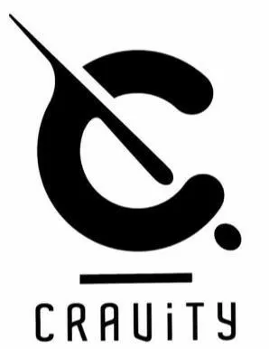

See this project on Github 👉 [Link](https://github.com/0w0i0n0g0/crvt-archive)

## 🎀 무엇을 만들까?

프로젝트 시작하기 전, 나는 아직 일주일 정도만 HTML, CSS, JS의 기초만 간단하게 공부한 상태였다.

그렇지만 일단 무언가를 만들면서 배우면 더 좋지 않을까? 🤔 라고 생각했다.

작지만 처음으로 하는 프로젝트이기 때문에, 내가 만든 것을 나만 아는 것이 아니라 많은 사람들도 내가 만든것을 봐주었으면 하는 마음이 컸다.

그래서 떠올린 것은 K-POP의 인기와 많은 팬들이었다.

아이돌에 관한 웹사이트를 만들면 많은 사람들이 찾지 않을까? 하는 기대에 프로젝트를 시작했다.

## 🛒 많은 아이돌 중에 누구를?

일단 너무 오래된 배테랑 그룹이나 가수는 이미 팬덤이 짜여져 있기 때문에, 이목을 끌기 힘들 것 같았다.

그래서 신인 아이돌 중에서 고르기로 했다.

- asepa


최근에 데뷔한 4인조 걸그룹으로 프로젝트의 주제로 알맞을 것 같았다.

그러나 대형 기획사인 SM엔터테인먼트 소속인 덕분인지, 뮤비 조회수가 1억을 그냥 넘기면서 배테랑 그룹이랑 다를게 없어보여 포기하였다.

- STAYC


데뷔한지 얼마 안된 신인이여서 프로젝트 주제로 좋았다.

그런데 진짜로 데뷔한지 너무 얼마 안되어 뭔가를 만들 거리가 없어서 아쉽지만 포기했다. 😥

- CRAVITY



데뷔한지도 몇달 정도 되어서 뭔가 만들 거리가 있고, 적당한 규모였다.

고르는데 시간을 너무 많이 써서 여기보다 더 좋을 순 없다고 생각하고 선택하기로 하였다.

걸그룹은 아닌게 아쉬웠지만 로고랑 앨범 표지 디자인이 깔끔한게 마음에 쏙 들었다. 👍

## 🎨 어떻게 웹사이트를 만들까?

직접 웹서버를 만들어서 호스팅 할 수도 있고, 아니면 이미 제공되는 무료 호스팅 서비스를 이용할 수도 있다.

그렇게 검색을 하던 중, 구글의 Blogger이라는 블로그 서비스를 알게 되었다.


Blogger를 선택하게 된 이유는 일반적으로 생각하는 네이버 블로그 같은 서비스들과는 다르게, 거의 모든 것을 코드를 통해 커스텀 할 수 있기 때문이다.

## 🎥 어떤 컨텐츠를 만들까?

아무래도 아이돌 그룹은 공중파 3사의 음악방송과 엠카운트다운 등에 많이 출연하게 된다.

그렇다면 여러 방송사의 음악방송을 한번에 모아 쉽게 찾아볼 수 있게 하면 편리하지 않을까?

그리고 역시 콘서트, 공연 또한 모아서 볼 수 있으면 좋을 것이다.

## 💟 웹사이트 꾸미기

### 테마를 내 입맛에 맞게 수정하기

영상 등이 주 컨텐츠인 웹사이트이기 때문에 포스트 목록에 있는 본문 미리보기 HTML 부분을 모두 삭제하였다.

CSS도 마음에 들게 조금씩 수정하였다.

### Header 꾸미기

텍스트로 제목만 적혀있으면 밋밋할 것 같아서 유튜브에서 공식 로고영상을 찾아, webP 이미지 포맷으로 변환하여 등록하였다.

반복재생 횟수는 1회로 설정하여 처음 접속할 때만 재생되도록 하였다.

### Favicon 등록

뭔가 허전하다 싶었는데 Favicon이 없어서 그랬다.

로고 이미지의 배경을 투명하게 만들고 Favicon으로 등록했다.

### 결과


## 🩹 하단 버튼 추가하기

### 주로 이 웹사이트를 무엇으로 볼까?

보통 간편하게 영상을 즐기고 소비하는데에는 아무래도 스마트폰을 사용할 것이다.

그래서 스마트폰 환경에서도 쉽게 사용할 수 있게 하단에 메뉴 버튼을 추가하기로 하였다.

### 구상하기

버튼을 그냥 만들면 웹사이트의 길이가 길어졌을 때 버튼을 찾기 어려워 질 것이다.

따라서 하단에 항상 고정된 버튼을 만들기로 하였다.

### 아이콘 선택하기

버튼을 만드는데 버튼 속에 텍스트 대신 아이콘을 넣고 싶었다.

그래서 열심히 구글링 한 결과 많은 곳에서 Font Awesome이라는 서비스를 이용한다고 한다.

엄청나게 다양한 종류의 아이콘을 보고 깜짝 놀랐다.


이 중에서 목록, 헤드셋, 통신탑 모양의 아이콘을 골랐다.

### 버튼 만들기

```html
<link
  crossorigin="anonymous"
  href="https://cdnjs.cloudflare.com/ajax/libs/font-awesome/5.15.1/css/all.min.css"
  integrity="개인키"
  rel="stylesheet"
/>

<center>
  <button class="button" onclick="location.href='#'">
    <i class="fas fa-list"></i>
  </button>
  &nbsp
  <button class="button" onclick="location.href='#'">
    <i class="fas fa-home"></i>
  </button>
  &nbsp
  <button class="button" onclick="location.href='#'">
    <i class="fas fa-broadcast-tower"></i>
  </button>
</center>
```

Font Awesome을 불러와주었다.

버튼을 3개 만들어 주고, 추후에 클릭하면 알맞는 링크로 이동할 수 있도록 onclick도 넣어주었다.

그리고 원하는 모양과 커서를 올렸을때의 느낌을 만들기 위해, Code Pen에서 공유된 코드에 내 입맛대로 이것 저것 추가해서 CSS도 만들고, 버튼이 하단에 고정될 수 있도록 하는 스크립트를 가젯으로 추가하였다.

### 결과


## 📼 콘텐츠 - 몰아보기

### 구상하기

'몰아보기'는 이 웹사이트의 가장 메인 콘텐츠로 모든 음악방송 출연분과 자체 콘텐츠를 한 곳에 정리해 즐길 수 있게 하는 것이다.

버튼을 누르면 해당 영상이 팝업되면서 시청할 수 있도록 한다.

### 기본 틀 짜기

각 음악방송 채널 별, 콘텐츠 별로 페이지를 만들어 메인 이미지를 등록하고, 목록 형식으로 음악방송은 올려진 날짜와 노래 제목을, 콘텐츠는 영상 제목을 순서대로 버튼으로 만들어 누르면 영상이 팝업되도록 만든다.

먼저 공중파 3사의 음악방송과 비티파크라는 콘텐츠로 '몰아보기'를 만들기로 하였다.

### 목록 버튼 만들기

css를 통해 버튼은 눌리는 느낌을 표현하였다.

그리고 밑의 사이트를 통해서, 메인 이미지에서 추출한 색으로 버튼에 색을 입혀서 페이지의 일체감을 줄 수 있도록 디자인 하였다.

[CSS Drive: Image to Colors Palette Generator](http://www.cssdrive.com/imagepalette/)

### 결과


### 기능 구현하기

버튼을 누르면 유튜브 영상을 팝업으로 보여주는 기능을 구현해야 한다.

팝업 기능은 magnificPopup라는 라이브러리를 활용하였다.

그런데 긴 유튜브 링크를 매번 버튼마다 걸어줄 수는 없기 때문에 영상의 ID만으로 유튜브 링크를 팝업시킬 수 있도록 만들었다.

```html
<button class="video" id="epPLS5yFoF4">EP.00 비티스쿨 전학생들</button>
<button class="video" id="gEKxYgfAGXA">[선공개] 비티스쿨 1교시 '국어시간'</button>
<button class="video" id="uIx9Zca_mx0">EP.01 온라인 개학</button>
```

### 결과


## 🎤 콘텐츠 - 콘서트

### 구상하기

아이돌이면 다양한 콘서트를 할 것이고, 올해 신인이기 때문에 연말에 몰려있는 콘서트와 시상식 스케줄이 많았다.

또한 코로나로 인해 모두 스트리밍으로 진행하고, 무료화 결정이 되어 유튜브를 통해 공개하는 콘서트도 많아져 아주 좋은 상황이였다.

### 만들기

콘서트가 코로나로 인해 무료로 유튜브나 공식 사이트를 통해 스트리밍 되는 것들을 embed 링크를 통해 불러왔다.

그리고 콘서트가 끝나면 컷 편집된 부분이 공식 유튜브 채널 등에 올라온 것을 몰아보기의 코드를 재사용해서 정리했다.

### 결과


## 📐 프로젝트 종료 및 분석

이 프로젝트를 시작한 시기가 이 아이돌 그룹의 비활동기가 끝나갈 때쯤으로, 이 때 팬들은 유튜브나 Vlive 같은 플랫폼을 통해 업로드된 컨텐츠를 소비하는 것이 거의 전부다.

이런 좋은 시기에 시작하게 되어, 지금까지 올라온 컨텐츠를 처음부터 쭉 편하게 정주행할 수 있게 해주는 '몰아보기'와 '콘서트'를 중심으로 팬들이 많이 방문해주었다.

연말과 연초를 맞으면서 다양한 콘서트와 시상식이 개최되어, 이에 맞춰 '콘서트'에 실시간 음악방송 정보와 영상을 꾸준히 반영하며 사용자를 모았다.

또한 콘서트가 끝나고 편집된 영상이 올라오면 업데이트를 하여 콘서트를 놓친 팬들도 빠지지 않고 시청할 수 있도록 하였다.

그러나 연말 시상식과 콘서트도 모두 끝나면서 방문자수도 급격히 줄어 두자리 수만 유지하였다.

## 🍻 프로젝트 결과

Blogger의 통계 기능에서 방문자 수를 확인할 수 있다.


웹사이트 개설 이후, 누적 방문자 수 약 6천명을 달성하였다.

콘서트 일정이 다 끝나고 나서는 콘텐츠 업데이트 없이 놔두었기 때문에 나름 성공적이였다고 생각한다! 🎉


새 앨범이 2020년 1월 19일에 발매되자 연말 시상식이 끝나고 저조했던 사이트의 방문수가 급격히 늘어난 것을 볼 수 있다. 인터넷은 참 신기한 것 같다. 🤣

구글 애널리틱스의 사용자 수 결과는 다음과 같다.


중복 하트가 불가능한 vlive 게시글의 하트가 1000개쯤인 것을 고려하면 아주 많은 방문자수다.

## 🎓 배운 점

무언가를 만드려고 하니 막히는 것을 해결하기 위해 공부를 하게 되어서 좋았다.

html의 구조, 어떻게 브라우저가 해석하여 보여주는지 등을 공부하는 계기가 되었다.

또한 타이밍이 얼마나 중요한지도 느꼈다.

비활동기가 끝나감 + 연말 특수 + 새 앨범 이라는 굉장히 좋은 타이밍이여서 생각보다 좋은 성과를 낼 수 있었던 것 같다.

코로나로 인해 모든 콘서트가 스트리밍으로 진행되면서 무료화로 전환된 것도 많아 운영하기 최적이였다.

연말이 끝나고 새앨범 발매사이의 짧은 2주 텀에도 방문자수가 두자리수로 떨어진걸 생각해보면, 이 때가 아니였으면 방문자 수가 얼마나 바닥을 쳤을지 모르겠다.🤣

## ✒️ 프로젝트를 마치며...

웹사이트 운영이라는 재밌는 일을 하기 위해 공부도 하고, 고등학교 졸업 후에 지루했던 일상생활에 활력이 되었다.

이 프로젝트를 하면서 실력이 많이 향상되었다고는 할 수 없겠지만, 코딩이 더 친숙해지고 좋아지는 계기가 되었다.

웹사이트를 만드는 것은 얼마 걸리지 않았고, 이미 만들어진 라이브러리를 적극 활용하였기 때문에 간단했다.

그러나 하루 건너 하나 있는 많은 콘서트와 시상식을 업데이트하고 꾸준히 운영하는 것이 시간이 은근히 들었다.

그래도 생각했던 것보다 많은 사람들이 방문하고 이용해서 뿌듯했다.

```toc

```
