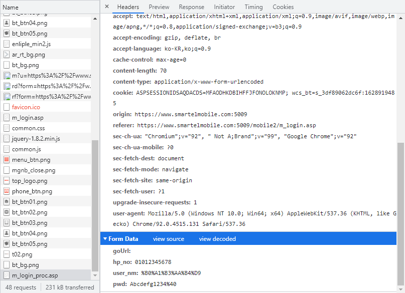
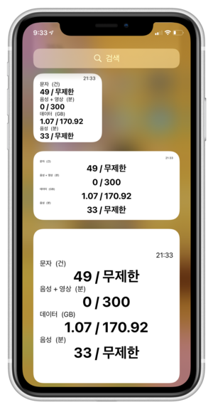
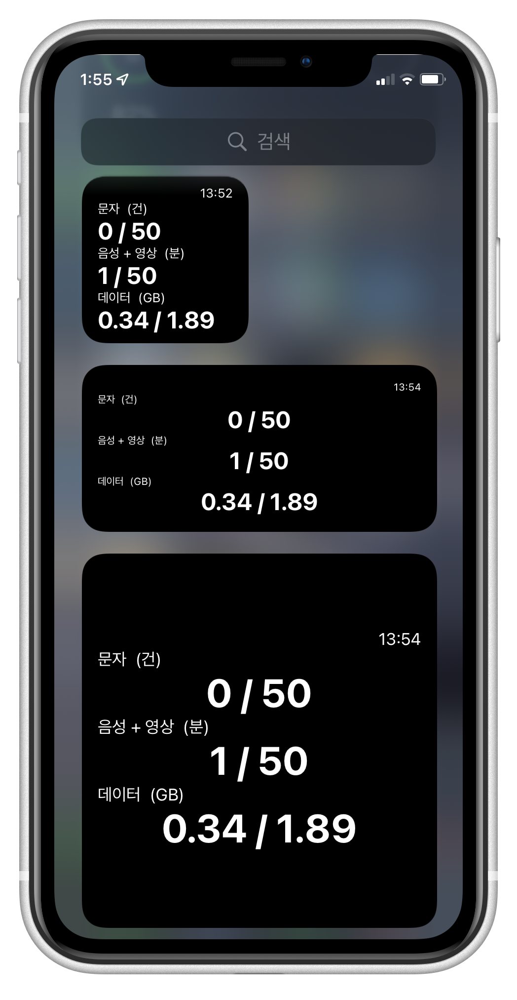

See this project on Github 👉 [Link](https://github.com/0w0i0n0g0/usage-widget-for-smartel)

## 📚 개요

- 아이폰용 알뜰폰 사용량 위젯

- 제작 기간 : 2021/8/6 ~ 2021/8/9

- v.2 업데이트 : 2022/4/8 ~ 2022/4/17

- 운영 기간 : 2021/8/9 ~

## 🏁 동기

나는 통신사의 멤버십이 필요없기 때문에 저렴한 알뜰폰을 사용하고 있다.

그러나, 알뜰폰은 저렴한 가격대신 부실한 고객대응과 사용자 편의기능 부족이 단점으로 꼽히고 있다.

나도 알뜰폰 중 "스마텔"을 사용하면서, 사용량 위젯이 없어 정말 불편했다.


그래서 내가 직접 위젯을 만들고, 배포도 하기로 하였다.

### 🤔 어떻게 만들까?

안드로이드는 스마텔 고객센터 앱이 있는데, 나는 아이폰을 사용하고 있고, 앱스토어에 스마텔 고객센터 앱 자체가 없다...

그래서 찾아보니 "마이스마텔"이라는 웹사이트를 고객센터 앱 대신 운영중이였다.

이 웹사이트를 이용해서 만들 것이다.

## 📣 위젯 만들기⁉

아이폰에 위젯을 만드려면

1. 앱스토어에 앱을 배포하여 그 앱에서 위젯을 추가한다.

2. 위젯을 추가해주는 서드파티 앱을 활용한다.

위 두가지 방법이 있다.

아직 iOS 개발도 안해봤고, 애플 개발자로 등록하려면 돈도 내야하기 때문에 💸 바로 2번을 택했다.

위젯을 추가해주는 서드파티 앱 중에서 코드로 작동이 되고, 유명한 앱이 있다.

바로 scriptable이다.


이전에도 유튜브 PiP 단축어를 사용하기 위해서 설치해본 적이 있다.

scriptable은 iOS 상에서 자바스크립트를 구동하여 자동화, 위젯 등 커스텀을 할 수 있도록 해준다.

이 앱을 활용해 위젯을 만들어보자.

## 📧 로그인 하기

사용량을 받아오기 위해서 먼저 로그인을 해야 한다.

개발자 도구를 활용해 로그인 시에 어떤 통신이 일어났는지 살펴보았다.



m_login_proc.asp로 POST 형식으로 로그인 정보가 전달되었다.

```js
//login to smartel
let reqlogin = new Request('https://www.smartelmobile.com:5009/mobile2/m_login_proc.asp');

reqlogin.method = 'POST';

reqlogin.headers = {
  'Content-Type': 'application/x-www-form-urlencoded',
  Origin: 'https://www.smartelmobile.com:5009',
};

reqlogin.body = 'goUrl=&hp_no=01012345678&user_nm=%B0%A1%B3%AA%B4%D9&pwd=Abcdefg1234%40';

reqlogin.onRedirect = function (request) {
  return null;
};

let reslogin = await reqlogin.loadString();
```

reslogin을 로그로 찍어보면 로그인에 성공되었는지 안 되었는지 알 수 있었다.

성공했다면 실명이 찍혀서 나오고, 실패하였다면 빈칸으로 나온다.

### 한글 인코딩 문제에 부딪히다.

단순히 한글을 URI 인코딩을 통해 정보를 보내면 될 것이라고 생각했지만 아무리 시도해보아도 로그인이 되지 않았다.

자세히보니 encodeURIComponent 함수로 인코딩한 것과 실제 로그인할 때 보내지는 것이 달랐다.

그렇게 몇시간을 구글에서 관련 자료를 검색하면서 원인을 알게 되었다.

### 진짜 문제 원인

진짜 문제는 "한글" 이름에 있다는 것을 알게 되었다.

모든 인코딩 사이트에서 기본적으로 한글을 URI인코딩 하면, 한글이 UTF-8로 지정되고 인코딩되었다.

그런데 로그인 페이지는 EUC-KR이라는 한글 인코딩을 사용하고 있었던 것이다. 😂

### 임시 방편으로 문제 해결...

원인을 알아도 난감했다.

자바스크립트에 자체적으로 EUC-KR을 URI인코딩하는 함수가 아무리 찾아도 없었고, 외부 라이브러리를 쓰기도 난감했다.

그래서 임시 방편으로 어쩔 수 없이 URI인코딩 사이트 중 EUC-KR을 지원하는 곳에 일일히 한글 텍스트를 보내서 인코딩된 정보를 받는 방법을 사용했다.

### 문제 해결! (v.2)

인터넷을 뒤지던 중 EUC-KR과 UTF-8을 모두 매핑해서 URI EUC-KR을 UTF-8로 디코딩하는 자바스크립트 파일을 찾아냈다.

[URL 인코딩 된 EUC-KR 문자열의 디코딩](https://blog.naver.com/csaiur/10044269972)

내가 원하는 것과 정반대의 기능이였지만, 매핑된 것을 반대로 연산해서 UTF-8을 URI EUC-KR로 인코딩 하는 기능을 추가했다.

이 것을 위젯 소스코드 자체에 삽입해서 외부의 도움없이 자체적으로 한글 인코딩을 할 수 있도록 해결했다.

## 📂 사용량 가져오기

### 사용량 받기

이제 로그인에 성공하였으니 사용량을 받아와야 한다.

사용량은 m_realTimePay_info_lg.asp에서 조회할 수 있다.

### 사용량 페이지 불러오기

```js
//load usage
let req = new Request('https://www.smartelmobile.com:5009/mobile2/m_realTimePay_info_lg.asp');

let res = await req.loadString();
```

res에 사용량 정보를 string으로 불러온다.

### 사용량 추출하기

이렇게 res에 string으로 요청하면 html이 string으로 저장된다.

loadJSON을 사용하면 더 편하게 정보에 접근할 수 있고 추출하는 과정을 거치지 않아도 되지만, 내가 사용량 서버를 운영하고 있지 않아서 어쩔 수 없었다.

따라서 받아온 문자열을 가공해서 사용량 정보를 추출했다.

사용량 정보는 res에 저장된 html에 table 태그로 감싸 담겨져 있다.

table 태그를 기준으로 문자열을 자르고, 내부에 필요없는 html 태그를 삭제한다.

그리고 줄바꿈 문자를 기준으로 문자열을 나눠서 배열로 저장한다.

사용량 정보가 table에 규칙적으로 저장되어 있기 때문에,

이렇게 하면 특정 주기로 문자, 음성, 데이터에 대한 정보가 일정하게 반복되어 구분할 수 있게된다.

undefined를 trim하면 에러가 나기때문에 건너뛰고, 반복하여 trim한다.

### 결과

```
사용량 배열
[SMT] USIM 스마트 심플(100분 + 1.5GB),문자,건,100,3,기본요금제,,[SMT] USIM 스마트 심플(100분 + 1.5GB),음성+영상,초,6000,358,기본요금제,,[SMT] USIM 스마트 심플(100분 + 1.5GB)(요금제종속),패킷데이터,KB,1536000,161152,요금제종속상품,,,
```

로그에 찍힌 결과이다. 말끔하게 정리되어 나온것을 알 수 있다.

## 📏 받아온 사용량 해석하기

### 배열 분석하기

앞에서 사용량을 usage_array라는 배열에 저장하였다.

이 배열은 table 태그에서 추출했기 때문에 규칙성이 있다.

요금제 내용 / 종류 / 단위 / 제공량 / 사용량 / 비고 / 빈칸

이 순서대로 반복된 배열이다.

이 배열을 분석하여 쓸모있는 데이터로 바꾸어보자.

### 결과

```
문자/1/문자/100
음성+영상/8/음성+영상/6000
패킷데이터/15/패킷데이터1536000
```

로그로 찍힌 결과이다. 잘 작동한다.

## 🦖 추가적인 기능 구현하기

### 새로고침되는 시간 표시

아무래도 실시간 사용량 위젯이다보니, 위젯이 새로고침되는 것이 매우 중요하다.

scriptalbe에서 제공하는 리프레시 함수를 설정해주었다.

```js
widget.refreshAfterDate = new Date(Date.now() + 1000 * 120);
```

다만 이렇게 설정해도 scriptalbe을 비롯한 모든 위젯 지원 앱들이 애플이 정한 위젯 정책 떄문에 설정한 시간에 바로 새로고침되지 않는 이슈가 있다.

이 불편함을 조금이라도 해결하기 위해 위젯에 새로고침된 시간을 표시하기로 하였다.

```js
//show when widget is refreshed
var now = new Date();
var hours = now.getHours();
var minutes = now.getMinutes();
```

이제 위젯이 최근에 새로고침된 시간을 표시할 수 있다.

### 수동 새로고침 기능

scriptable은 위젯을 눌렀을 때 실행할 기능을 설정할 수 있다.
위젯을 만들 때 When Interacting을 Run Script로 설정하면 수동으로 새로고침을 할 수 있다.

### 단축어로 위젯 설치 (v.2)

기존에는 직접 코드를 복붙하거나, 설치 함수를 복붙해서 실행하는 방식으로 설치를 안내했는데, 누가봐도 불편하고 잘 못하는 분들도 많을 것 같아 단축어만으로 위젯을 설치할 수 있도록 기능을 추가했다.

단축어 기능 중 url로 콘텐츠 가져오기를 활용하여 raw 파일을 불러와 scriptable에서 여는 방식으로 다운로드를 구현했다.

[설치 과정 보러가기](https://github.com/0w0i0n0g0/usage-widget-for-smartel#%EC%84%A4%EC%B9%98)

### 키체인 활용하기 (v.2)

기존에는 직접 코드에 사용자가 로그인 정보를 입력해야했고, 이 파일이 유출된다면 그대로 개인정보가 보여지는 문제가 있었다.

그래서 단축어로 설치하는 기능을 추가하면서 scriptable에서 제공하는 키체인 기능을 활용하여 보안도 강화하고, 로그인 정보도 단축어로 설정할 수 있도록 구현했다.

```js
let NAME = 'user_nm';
let PHONE = 'hp_no';
let PASSWORD = 'pwd';

Keychain.set(NAME, args.plainTexts[0].replace(/\s/gi, ''));
Keychain.set(PHONE, args.plainTexts[1].replace(/\s/gi, ''));
Keychain.set(PASSWORD, args.plainTexts[2].replace(/\s/gi, ''));

if (Keychain.contains(NAME) && Keychain.contains(PHONE) && Keychain.contains(PASSWORD)) {
  return '성공!';
} else {
  return '실패. 다시 시도해주세요.';
}
```

args.plainTexts로 단축어에 입력한 텍스트를 가져와 키체인을 set하는 방식이다.

## 👀 위젯 디자인하기

### 위젯 종류

애플이 제공하는 위젯 크기는 앱크기 기준으로, 2x2, 2x4, 4x4 사이즈, 총 3종류가 있다.

사용자가 어떤 크기를 원할지 모르고, 특정 요금제는 표시되는 정보가 크니 모든 사이즈에 호환되게 디자인했다.

### 만들기

다만 고려해야 하는 점은, 무제한 요금제일땐 음성과 음성+영상이 따로 표시된다.

무제한 요금제는 보동 음성을 무제한으로 주고, 음성+영상이라는 부가통화에 제한이 걸려있다.

이를 고려해 음성을 표시하는 call에 따라, 위젯의 크기에 따라, 총 6개의 설정 중 알맞는 설정이 자동으로 적용되도록 만들었다.

### 결과





## 🔖 마무리

처음으로 배포하는 프로그램이기 때문에 정말 뜻깊었다.

다른 사람들도 사용할 수 있도록 README도 최대한 자세하게 📑 적으려고 노력했다.

그리고 여러 회선으로 테스트하며 정상작동을 확인하였다.

저렴하게 알뜰폰으로 바꾸는데 도움을 준 커뮤니티들에 링크를 올렸고, 생각보다 많은 관심을 받았다.

부족하게 만들어도 사용해주는 많은 사람들과 도움이 되었다는 댓글 등을 보면서 뿌듯함을 느꼈다. 🥰

## 💡 분석, 배운 점

사실 중간에 인코딩 문제때문에 조금 막힌 것 말고는 닥치는대로 만들었기 때문에, 생각하며 만들지를 못했다.

단순히 웹사이트 정보 -> 위젯을 생각하고 있었고, 이외의 것이 많이 신경을 쓰지 못했던 것이 아쉬웠다.

특히 받아온 사용량을 해석하는 부분의 로직이 마음에 들지 않았지만 구현하는데에 급급해서 반복문 복붙으로 만들어 버렸다...

그래도 혹시라도 발생할 수 있는 오류에 대비해 사용해주시는 분들이 로그만 올리면 고칠 수 있도록, 로그를 보기 쉽고, 필요한 정보를 모두 넣은 것을 잘했다고 생각한다.

만들때도 로그를 통해 어디에서 멈추거나, 어디에서 잘못되었는지 쉽게 찾아내서 고칠 수 있어 편리했다.

```toc

```
