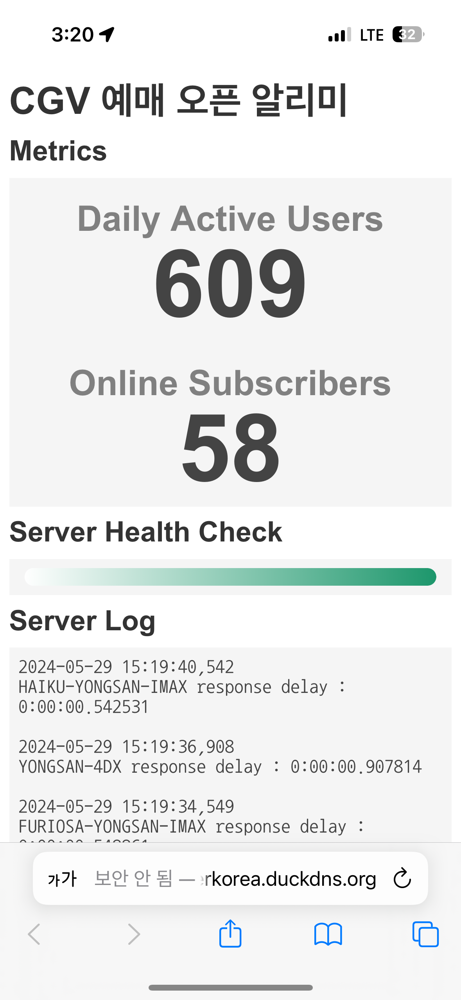

See this project on Github 👉 <a href="https://github.com/0w0i0n0g0/cgv-open-push" target="_blank" rel="noreferrer noopener">Link</a>

## 📚 개요

- CGV 예매 오픈 알리미

- 제작 기간 : 2024/3/2 ~ 2024/3/11 ~ 유지보수 중

- 라즈베리파이로 운영한 기간 : 2024/3/2 ~ 2024/6/3

- Docker Container로 운영한 기간 : 2024/6/3 ~ 운영 중

## 🏁 제작 동기

우리나라 단연 최고의 영화관이라고 할 수 있는 CGV 용산아이파크몰 IMAX관.

그러나 1.43:1 비율의 IMAX GT 비율의 영화가 개봉한다고 하면 새벽과 심야 시간 때까지 매진 행렬이 이어진다.

나도 좀 편하게 명당자리에서 보고 싶어서 예매가 오픈되었을 때 알림을 보내주는 프로그램을 만들기로 하였다.

## 📑 영화 예매 정보 가져오기

처음에는 Selenium이나 Beautiful Soup 같은 것으로 크롤링, 스크래핑을 하려고 했지만 몇 번 시도해 보다가 변수가 너무 많았고, 구현하고자 하는 목적에 맞는 방법이 아니라고 생각이 들어 개발자 도구로 CGV 홈페이지를 뜯어보기 시작했다.

### 사이트 분석

개발자 도구를 통해 요청을 몇 번 보내보니 ```http://ticket.cgv.co.kr/CGV2011/RIA/CJ000.aspx/CJ_TICKET_SCHEDULE_TOTAL_PLAY_YMD``` 와 같은 곳으로 json 데이터로 검색 필터를 설정할 값을 전송하는 것을 확인했다.

다만 이 데이터들은 AES 암호화되어 있어, 원래 값을 정확하게 알 순 없었지만, 그 값들의 원래 뜻은 json의 key값을 통해 유추할 수 있었다. 

```python
# 듄-파트2 용산아이파크몰 IMAX관의 예매 정보를 가져올 때 전송하는 json 값
    {
        "REQSITE": "x02PG4EcdFrHKluSEQQh4A==",
        "TheaterCd": "LMP+XuzWskJLFG41YQ7HGA==",
        "ISNormal": "3y+GIXzg3xKpOjlKjH8+Fg==",
        "MovieGroupCd": "bNQovwyoamC5EsbGvSDIqw==",
        "ScreenRatingCd": "nG6tVgEQPGU2GvOIdnwTjg==",
        "MovieTypeCd": "/Saxvehmz4RPKZDKNMvSKQ==",
        "Subtitle_CD": "nG6tVgEQPGU2GvOIdnwTjg==",
        "SOUNDX_YN": "nG6tVgEQPGU2GvOIdnwTjg==",
        "Third_Attr_CD": "nG6tVgEQPGU2GvOIdnwTjg==",
        "Language": "zqWM417GS6dxQ7CIf65+iA==",
    },
```

### 가져온 영화 예매 정보 분석

위의 json 데이터를 post로 전송하면 다음과 같은 형식의 영화 예매 정보 xml 파일을 받을 수 있다.

```xml
<CSchedule>
  <PlayDays>
    <CPlayDay>
      <PLAY_YMD>20240331</PLAY_YMD>
      <FORMAT_DATE>2024년03월31일(일)</FORMAT_DATE>
    </CPlayDay>
  </PlayDays>
  <Movies>
    <CMovie>
      <GROUP_CD>20035290</GROUP_CD>
      <GROUP_NM>듄-파트2</GROUP_NM>
      <MOVIE_CD>20035760</MOVIE_CD>
      <RATING_CD>03</RATING_CD>
      <PLATFORM_CD>02</PLATFORM_CD>
      <TRANS_CD>02</TRANS_CD>
      <PLATFORM_ATTR_CD>04</PLATFORM_ATTR_CD>
      <SUBTITLE_CD />
      <SUBTITLE_NM />
      <MOVIE_COLLAGE_YN>N</MOVIE_COLLAGE_YN>
      <TICKET_RATE>9.14</TICKET_RATE>
      <STAR_POINT>96.00</STAR_POINT>
      <SOUNDX_YN>N</SOUNDX_YN>
      <THIRD_ATTR_CD />
      <THIRD_ATTR_NM>0000000909</THIRD_ATTR_NM>
      <MOVIE_ATTR_CD>04</MOVIE_ATTR_CD>
      <MOVIE_ATTR_NM>IMAX</MOVIE_ATTR_NM>
      <MOVIE_PKG_YN>N</MOVIE_PKG_YN>
      <MOVIE_NOSHOW_YN>N</MOVIE_NOSHOW_YN>
    </CMovie>
  </Movies>
  <GroupMovies>
    <CGroupMovie>
      <MOVIE_CD_GROUP>20035290</MOVIE_CD_GROUP>
      <MOVIE_GROUP_NM>듄-파트2</MOVIE_GROUP_NM>
      <TICKET_RATE>9.14</TICKET_RATE>
      <STAR_POINT>96.00</STAR_POINT>
      <RATING_CD>03</RATING_CD>
      <POSTER>http://img.cgv.co.kr/Movie/Thumbnail/Poster/000087/87947/87947_185.JPG</POSTER>
      <MOVIE_IDX>87947</MOVIE_IDX>
      <MOVIE_PKG_YN>N</MOVIE_PKG_YN>
      <MOVIE_NOSHOW_YN />
    </CGroupMovie>
  <STheaters>
    <CSTheater>
      <THEATER_CD>0013</THEATER_CD>
      <THEATER_NM>CGV 용산아이파크몰</THEATER_NM>
      <AREA_CD>13</AREA_CD>
      <RATING_CD>02</RATING_CD>
      <DIRECT_RELATED_YN>Y</DIRECT_RELATED_YN>
    </CSTheater>
  </STheaters>
  <Screen>
    <CScreen>
      <RATING_CD>02</RATING_CD>
      <RATING_NM>아이맥스</RATING_NM>
    </CScreen>
  </Screen>
</CSchedule>
```

여기서 집중할 것은 상영일인 ```PlayDays```이다.

여기에 날짜가 추가될 때 알림을 보내면 된다.

## ♾️ 예매 오픈을 확인할 메인 로직

요청을 일정 주기마다 넣어서 받은 영화 예매 정보 xml이 바뀌는지 확인하고, 여기서 날짜가 추가되면 알림을 보내는 방식으로 만들었다.

### 기준 값 초기화하기

먼저 기준 값을 ```response1```으로 정해서 응답을 받아 저장한다.

```python
response1 = extract_playdays(get_request_to_cgv_api(url, cookies, headers, json_data, target_name))
response2 = ""
```

### 변경사항 찾기

```response2```에 일정 시간마다 갱신된 예매 정보를 저장하여 ```response1```과 비교하고, 변경사항을 찾는다.

```python
while True:
  # 5초마다 예매 정보 불러오기
  time.sleep(5)
  # 2번에 새 응답 저장
  response2 = extract_playdays(get_request_to_cgv_api(url, cookies, headers, json_data, target_name))

  # 새 응답과 저장된 이전 응답이 다르다면
  if response1 != response2:
      dmp = diff_match_patch()
      # diff에 응답끼리 다른 부분을 추출 {(-1, "삭제된 부분"), (1, "추가된 부분")}
      diff = dmp.diff_main(response1, response2)
```

### 예매 오픈 푸시 알림 전송하기

```added_result```에 추가된 변경사항을 모두 문자열로 저장하고, 예매 오픈 푸시 알림을 전송한다.

```python
for d in diff:
  ## d[0]가 1이면 추가된 요소
  if d[0] == 1:
      try:
          added_result += extract_text_between_tag(d[1], "FORMAT_DATE")
      except:
          added_result += d[1] + "\n"

#추가된 요소가 있으면
if added_result != "":
  # 추가된 변경사항 푸시알림 보내기
  try:
      send_open_push(str(added_result), target_name)
  except Exception as e:
      logging.error(f'{target_name} error when sending open push : {e}')
```

### (업데이트) 특별관 예매 오픈을 확인하자!

위의 코드로는 특정한 영화 하나에 대해서만 예매 오픈 확인을 할 수 있다.

여기서 조금 더 확장하여 인기가 좋은 특별관에 대해서 예매 오픈 알림을 받아보고 싶었다.

그래서 위의 예매 오픈 확인 로직을 조금 변경하여 특정한 영화가 아니라 특정한 상영관에 대해서 예매 오픈을 확인해보려고 한다.

```python
# 용산아이파크몰 IMAX관
{
    'REQSITE': 'x02PG4EcdFrHKluSEQQh4A==',
    'TheaterCd': 'LMP+XuzWskJLFG41YQ7HGA==',
    'ISNormal': 'ECFppiyFz/nvSGsg7VwPQw==',
    'MovieGroupCd': 'nG6tVgEQPGU2GvOIdnwTjg==',
    'ScreenRatingCd': 'kXwoR3tnLM/+Tu0BILP3Qg==',
    'MovieTypeCd': 'nG6tVgEQPGU2GvOIdnwTjg==',
    'Subtitle_CD': 'nG6tVgEQPGU2GvOIdnwTjg==',
    'SOUNDX_YN': 'nG6tVgEQPGU2GvOIdnwTjg==',
    'Third_Attr_CD': 'nG6tVgEQPGU2GvOIdnwTjg==',
    'Language': 'zqWM417GS6dxQ7CIf65+iA==',
},
```

위와 같은 json 데이터로 요청을 하면 용산아이파크몰 IMAX관에서 상영하는 모든 영화에 대한 응답이 온다.

그 데이터들을 위의 로직과 유사하게 이전 응답과 바뀐 부분을 감지하여 예매 오픈을 확인할 수 있다.

다만 이전에는 한 영화에 대한 응답만 오기 때문에 PlayDays만 추출하여 비교하면 됐지만, 이젠 그 상영관에서 상영하는 모든 영화에 대한 정보들이 오게 된다.

그러면 예매 오픈과 무관한 불필요한 정보들이 변경될 때도 알림이 올 수 있기 때문에, 예매 오픈 확인에 꼭 필요한 부분만 남기고 삭제하는 전처리 과정이 필요하여 다음과 같이 처리했다.

```python
# cgv_open_push_function.py
# 특별관 예매 오픈 알림에 필요 없는 태그 제거하기
def screen_remove_useless_tags(xml_string):
    useless_tags = {"PLAY_YMD", "GROUP_CD", "MOVIE_CD", "RATING_CD", "PLATFORM_CD", "TRANS_CD", "PLATFORM_ATTR_CD", "MOVIE_COLLAGE_YN", "TICKET_RATE", "STAR_POINT", "SOUNDX_YN", "THIRD_ATTR_CD", "MOVIE_ATTR_CD", "MOVIE_PKG_YN", "MOVIE_NOSHOW_YN", "POSTER", "MOVIE_IDX", "THIRD_ATTR_NM", }
    for tag in useless_tags:
        xml_string = remove_text_between_tag(xml_string, tag)
    return xml_string

# cgv_open_push_screen.py
# 불필요한 부분 삭제
response1 = screen_remove_useless_tags(response1)
response2 = screen_remove_useless_tags(response2)
```

이제 이렇게 처리된 두 문자열을 비교하는 방식으로 특정한 상영관에 대해서 모두 예매 오픈 알림을 받을 수 있게 되었다!

## 🏪 메인 로직을 24/7 실행하기

### 여러 영화들에 대해서 확인하기

다음과 같은 방법으로 입력된 ```json_data```에 대해 메인 로직을 쓰레드로 동시에 모두 실행시킬 수 있다.

```python
for data in enumerate(json_data):
    t = threading.Thread(target=main, args=(url, cookies, headers, data[1], target_name[data[0]]))
    t.start()
```

### 예외 발생 시 예외 처리

메인 로직 실행 중에 예외가 발생된다면, 발생한 오류를 푸시 알림으로 전송하고, 로그를 남긴다.

그리고 해당 파이썬 프로그램을 다시 실행한다.

```python
except Exception as e:
    send_push_to_ntfy(f"{target_name}\n서버에서 오류 발생🚨\n{e}", target_name)
    send_push_to_private_ntfy(f"{target_name}\n서버에서 오류 발생🚨\n{e}", target_name)
    logging.error(f'{target_name} error : {e}')
    # 다시 실행
    os.execl(sys.executable, sys.executable, *sys.argv)
```

## 🔔 알림 보내기

### ntfy

ntfy라는 오픈소스 프로젝트를 사용하여 거의 모든 운영체제에 손쉽게 푸시 알림을 보낼 수 있다.

알림 권한을 직접 설정하고, 오류 대처도 빠르게 하기 위해서 라즈베리파이로 직접 ntfy 서버까지 설치하여 호스팅 했다.

> 참고 사이트
>- https://docs.ntfy.sh/install/
>- https://docs.ntfy.sh/config/

### (업데이트) Docker로 운영하기

서버를 이전하면서 ntfy도 Docker로 운영하게 되었다.

## 🔋 서버 상태 확인 페이지

24시간 동안 계속 동작해야 하고, 서버에 오류가 생기거나 다운되었을 때, 이를 쉽게 확인할 방법이 필요했다.

Python 마이크로 웹 프레임워크인 Flask를 통해 간단하게 서버 상태 확인 페이지를 만들었다.

이 페이지에는 하루 활성 사용자 수와 인터넷에 연결되어 있는 구독자 수, 서버의 Health Check 그리고 서버 로그의 일부분을 표시한다.

하루 활성 사용자 수 (Daily Active Users : DAU)와 인터넷에 연결되어 있는 구독자 수(Online Subscribers)는 ntfy의 metrics에서 제공하는 통계에서 제공한다.

Health Check는 마지막으로 예매 정보를 받은 시간과 현재 시간과의 차이를 통해 그 시간의 차이가 3초와 비교했을 때 얼마나 차이가 나냐를 기준으로 바 형태의 그래프로 표시하고, 차이가 5초 이상이면 빨간색으로 바뀌며 서버의 상태를 표시하게 했다.

그래프의 길이와 색을 통해 서버가 잘 동작하고 있는지 쉽게 판단할 수 있다.

```html
<h2>Server Health Check</h2>
      <div id="health-check">
         <progress value='3' max='{time_diff}'></progress>
      </div>
```

서버 로그는 제일 마지막 줄부터 10줄을 불러와서 제공한다. 즉, 최신 로그 10개를 표시하게 된다.

### 결과

서버를 이전하기 전 마지막 화면이다.



### (업데이트) 서버 이전 이후...

서버가 사용자와 직접 연결되지 않고 클라우드플레어 터널로 연결되어 있어 활성 이용자 수 집계가 불가능해져서, 현재는 활성 구독자수만 표시하고 있다.

또한 전체 로그는 Docker로 관리하게 되어서, 이 페이지에는 cgv에 요청한 로그들만 출력하고 있다.

## 🖥️ 서버 운영 및 성과

### 자동 실행 설정하기

라즈베리파이를 부팅할 때 자동으로 CGV 예매 오픈 알리미가 동작하도록 설정했다.

먼저 ```/etc/xdg/lxsession/LXDE-pi/autostart```에 ```@bash /home/pi/afterstart.sh```를 추가한다.

그리고 ```afterstart.sh```를 다음과 같이 작성해주었다.

```bash
(메인 파일 실행)
python cgv_open_push_main.py &
(서버 상태 확인 페이지 실행)
python cgv_open_push_status.py &
(ntfy 실행 확인)
echo 'raspberry' | sudo -S ntfy serve
(prometheus 실행)
cd prometheus
./prometheus --web.listen-address=:9010
```

### 보안 설정하기

최소한의 외부 공격과 보안을 위해서 Router 단에서 해외 IP를 차단했다.

보안상 노출되면 안되는 ssh 포트 및 Admin용 관리 페이지와 연결되는 포트는 모두 내부망에만 존재하고, 포트포워딩을 통해 외부망으로는 ntfy 알림 서버 포트와 서버 상태 확인 페이지 포트만 연결하였다.

또한 ntfy에서 자체적으로 Go의 rate package으로 token bucket을 활용하여 rate limit을 둔다.

### (업데이트) Docker 활용하기

라즈베리파이에 서버를 구동하니, 코드를 수정할 때마다 배포하는 것이 너무 불편하였고, 성능이 받쳐주지 못해서 툭하면 뻗는 문제가 있었다.

그래서 아예 미니 PC로 서버를 구축해서 Docker Container로 올리기로 결정했다.

서버 구축 내용은 여기서 볼 수 있다.

다음과 같이 Dockerfile을 만들었다.

```Docker
FROM python:3.10

LABEL name="cgv-open-push"

WORKDIR /

COPY * .

# ntfy token e.g. "Bearer tk_abcdefghijklmnopqrstuvwxyz"
ENV NTFY_TOKEN=""
# private ntfy server address e.g. "https://ntfy.sh"
ENV PRIVATE_NTFY_SERVER_ADDRESS=""
# private ntfy prometheus address e.g. "https://ntfy.sh/metrics"
ENV PRIVATE_NTFY_PROMETHEUS_ADDRESS=""

RUN pip install -r requirements.txt

ENTRYPOINT ["python"]
CMD ["cgv_open_push_main.py"]

EXPOSE 5000
```

```python
# requirements.txt
diff_match_patch==20230430
Flask==3.0.3
Requests==2.32.2
```

이제 도커 이미지를 빌드해서 서버에서 컨테이너만 새 이미지로 재시작하면 서버를 무중단 운영할 수 있게 되었다!

## ⏰ 예매 오픈 알림을 받았다!


알림이 잘 와서 영화를 빠르게 예매할 수 있었다.

## 🔖 마무리

덕분에 명당에서 영화를 볼 수 있었고, 나뿐만이 아니라 이걸로 알림을 받아서 재미있게 보고 왔다고 해주시는 분들도 감사했다.

내가 신경 쓸 수 있을 때까지는 최대한 운영해보려고 한다.

## 💡 분석, 배운 점

24시간 돌아가는 서버를 운영해 보니 예상치 못한 오류나 상황으로 인해 불상사가 생기는 것을 경험할 수 있었고, 이후에 발생할 수 있는 모든 상황에 대한 예외처리나 오류를 미리 신경 써서 대비하는 등 안정성에도 집중하여 만들게 되었다.

> 실제로 예외처리를 놓친 부분에서 cgv 서버에서 http 응답이 200이 아닌 429 Too Many Requests가 뜨게 되자, 서버가 종료가 되어버렸고, 결국 집에 돌아와서 재실행하기 전에 예매가 오픈되어 버려 알림이 무용지물이 되어버린 사고가 일어났었다.

또 라즈베리파이에서 서버를 그냥 운영하니 CI/CD 측면에서 불편한 점이 너무 많아 Docker를 사용해보았는데 너무너무 편리하였다. 

앞으로도 운영과 배포에도 처음부터 더 신경을 써야할 것이다. 

```toc

```