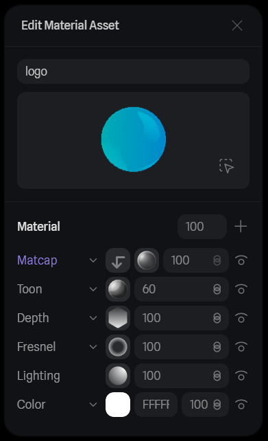
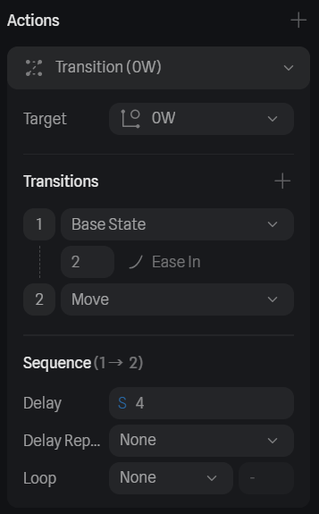
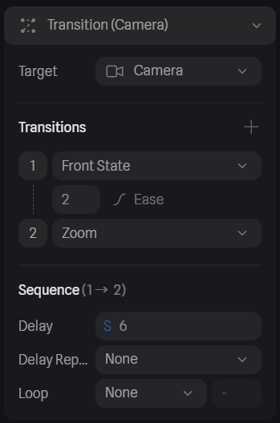
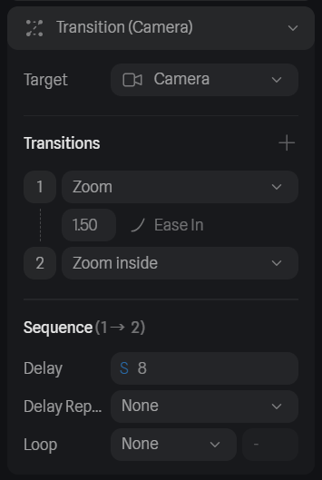
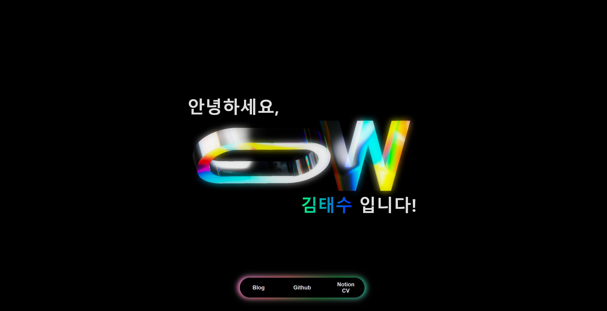

See this project on Github 👉 <a href="https://github.com/0w0i0n0g0/wzero.dev" target="_blank" rel="noreferrer noopener">Link</a>

## 📚 개요

- wzero.dev 랜딩 페이지

- 제작 기간 : 2024/6/25 ~ 2024/7/1

## 🏁 제작 동기

CGV 예매 오픈 알리미 때문에 개인 서버를 구축하고, 도메인도 구매하게 되었다.

그런데 파이썬이랑 ntfy 알림 서버만 돌아가니까 당연하게도 서버 자원이 너무 많이 남았다. (CPU 점유율이 1% 대에서 놀고 있다...)

그래서 이 서버와 도메인을 어떻게 더 잘 활용할 수 있을까 고민하다가 나만의 랜딩 페이지를 만들어보고 싶어졌다.

그리고 요즘 웹사이트에서 3D 모델이 멋지게 있는 걸 보고 꼭 만들어보고 싶었는데 이번 기회에 한 번 직접 도전해보았다.

> 물론 성능 상의 문제로 3D 모델을 이미지나 영상 형태로 정해진 애니메이션만 보여주는 곳이 더 많지만, 3D 모델과 직접 상호작용할 수 있는 웹사이트가 더 좋은 경험으로 남아있다.

## 🧊 3D 모델 제작

브라우저에서 3D 모델을 보여주려면 WebGL이나 WebGPU와 같은 3D 그래픽을 렌더링하기 위한 기술을 사용하게 된다.

WebGL은 OpenGL을 플러그인 도움 없이 브라우저에서 공식적으로 사용할 수 있도록 해서 3D와 2D 그래픽을 표현하는 JavaScript API이고, WebGPU는 여기서 더 나아가 GPU에 대한 저수준의 제어를 할 수 있고, WebGL보다 월등한 성능을 보여준다.

또한 Three.js와 같은 JavaScript 라이브러리가 WebGL나 WebGPU를 쉽게 활용하여 3D 모델을 쉽게 표시하고 조작할 수 있도록 도와준다.

그런데 3D 모델링은 해본 적이 없기 때문에 초보자도 손쉽게 무료로 사용할 수 있는 것을 찾았고, Spline이라는 인기를 얻고 있는 3D 디자인 툴을 사용하게 되었다.


Spline에서 만든 3D 모델은 여러가지 방식으로 배포할 수 있는데, Spline에서는 제작한 3D 모델 파일을 렌더링하는 자바스크립트 런타임 환경도 제공하고 있었다.

이를 React에서 사용할 수 있게 만든 패키지를 사용하여 내 3D 모델을 브라우저에서 렌더링 하는 방법을 사용했다.

### 로고 만들기


내 ID '0w0i0n0g0'에서 0과 W를 따와서 깃허브 프로필 사진으로 사용하던 로고이다.

랜딩 페이지를 위해 이 예전 로고를 더 깔끔하게 다듬고 색도 잘 보이도록 수정해서 새 로고로 만들었다.


이제 이 로고를 3D 모델로 만들어야 하는데, 방법은 간단했다.

먼저 `0` 부분은 양 끝이 둥근 사각형을 큰 것과 작은 것 두 개를 크기만 다르게 만든 다음에, `Boolean`으로 합쳐주면 겹친 부분이 삭제된다.

`W` 부분은 로고에 맞는 글꼴로 W를 생성한 다음, `Extrusion`으로 두께를 주면 입체가 된다.

이제 로고대로 예쁘게 모양을 잡아주면 모델링 완성이다.


### 질감 설정하기

3D 모델에 `Material`을 설정하여 색과 빛 반사 등 여러가지 질감을 설정해줄 수 있다.



위와 같이 `Depth`로 그라데이션을 주고 `Matcap`, `Fresnel` 등 다양한 설정으로 질감을 완성했다.


## 📹 인트로 애니메이션

이제 완성한 3D 모델로 랜딩 페이지에 접속하면 먼저 보여줄 인트로 애니메이션을 만들어보자.

랜딩 페이지에 접속하면 3D 인트로 애니메이션을 보여주고, 그 다음 인터렉션할 수 있는 메인 랜딩 페이지를 보여주도록 구상했다.

한 번 인트로 애니메이션을 만들어보자.

### 정면으로 이동시키기

처음 시작은 로고를 대각선 위에서 내려다보는 시점에서 완전히 정면으로 보는 시점으로 이동하는 애니메이션으로 구상했다.

시점이 이동하는 애니메이션은 카메라의 State를 처음 것과 나중 것을 설정한 후 `Transition`으로 easing function 등을 설정해주면 부드럽게 카메라가 처음 State에서 나중 State로 전환되도록 만들 수 있다.


처음 시작할 때 카메라의 시점 `Base State`이다.


카메라가 최종적으로 보여줄 정면 시점 `Front State`이다.


위와 같은 Events를 `Start`할 때 실행되도록 하면, 0초의 딜레이로 시작하자 마자 카메라가 `Base State`에서 `Front State`으로 4초 동안 전환되는 애니메이션이 실행된다.

### 옆으로 이동시키기

이전 애니메이션이 로고를 정면으로 바라보는 시점에서 마무리 되었다.

다음으로는 로고의 `0` 부분이 화면의 정중앙에 오도록 이동시키고, `W` 부분은 화면 밖으로 사라지게 하여 결과적으로 로고의 `0` 부분이 화면에 꽉 들어차는 모습을 만들어보자.

먼저 로고 전체의 좌표를 옆으로 이동시켜서 새로운 `Move State`를 만든 다음, `Base State`에서 `Move State`로 이를 `Start` 이벤트에서 4초의 딜레이 후에 Transition을 적용하면 이전에 만든 '정면으로 이동시키기' 애니메이션이 끝난 후 실행된다.



그 다음 로고의 `W` 부분을 완전히 화면 밖으로 이동시킨 다음, 완전히 제거하는 애니메이션이다.

딜레이와 전환 시간을 잘 조정하여 `W` 부분이 화면 밖으로 이동하는데까지 8초, 그리고 9초에 사라지게 설정했다.


또한 동시에 카메라도 조금 더 가까이 다가가게 만들어서 확대되는 느낌도 주었다.



시작 딜레이를 6초로 설정하여 3D 모델이 옆으로 이동함과 동시에 확대되는 애니메이션이 실행된다.

### 안으로 들어가기

이제 화면에 보이는 로고의 `0` 부분 속으로 들어가는 듯한 애니메이션으로 인트로를 마무리 해보자.

카메라 State를 기존 State에서 확대하는 것으로 전환시키면 쉽게 만들 수 있다.

그런데 너무 밋밋해 보여서 로고가 한 바퀴 돌면서 그 속으로 들어가는 듯하게 만들어 보았다.

로고에 x좌표 쪽 Rotate 수치에 180을 더해주면 x축 기준으로 180도 돌아가게 된다.

이렇게 만든 `Rotate State`로 트랜지션을 추가하여 한 바퀴 도는 애니메이션을 카메라가 확대하는 애니메이션과 같은 시간에 두면 동시에 적용된다.


7.5초부터 1.5초 동안 회전이 되게 된다.

그리고 회전이 0.5초 동안 진행되고 있는 8초부터 안으로 들어가는 애니메이션을 추가하여 더 역동적인 느낌을 표현했다.



여기까치 총 9.5초의 인트로 애니메이션이 마무리되고, 마지막 카메라 상태에서는 검은 배경화면만 출력되는 것으로 끝나게 된다.

### 모바일 화면 대응하기

그런데 지금 만든 인트로 애니메이션은 일반적인 PC 환경에서는 가로 화면으로 제대로 실행되지만, 모바일 환경에서는 세로 화면이 일반적이기 때문에 양 옆이 잘려서 나오게 된다.

이를 해결하기 위해 모바일 용 `Scene`을 따로 만들어서, `Screen Resize` 이벤트가 발생하면 그 Scene으로 자동 전환되도록 했다.


## 🛬 메인 랜딩 페이지 구성

메인 랜딩 페이지에는 인사말과 마우스 커서를 바라보는 인터렉션이 있는 3D 모델, 그리고 깃허브와 블로그, CV 페이지로 안내하는 버튼들로 구성했다.

먼저 마우스 커서를 바라보는 인터렉션을 가지는 3D 모델을 만들어보자.

### 이벤트 설정하기

마우스 커서를 바라보는 이벤트는 Spline에서 기본적으로 `Look At`이라는 이벤트를 정의해두어서, 이 이벤트가 발생하면 움질일 수 있는 범위와 방향 등 어떤 식으로 동작할지만 설정해두면 된다.


그런데 그냥 마우스 커서를 바라만 보니까 너무 밋밋한 것 같아, 로고의 `0` 부분이 계속 회전하도록 추가해주었다.

마찬가지로 인트로 애니메이션에서 설정했던 것처럼 설정해주고, Loop를 Infinite로 두면 계속 회전하게 된다.

### 질감 설정하기

먼저 생각한 질감 느낌은 유리 재질이었다.

요즘 굉장히 많은 곳에서 기술적임과 깔끔함, 단정함을 나타내기 위해 글래스모피즘도 그렇고 유리 느낌을 많이 사용하고 있다.

최근 런칭된 배민클럽 로고도 유리 느낌의 3D 로고였는데, 한 번 보고 너무 마음에 들어서 아직까지도 기억에 남아있다.

그래서 최대한 몽환적인 느낌을 주는 유리 질감을 만들어 3D 로고 모델에 적용해보았다.


> 여러 시행착오를 거쳐 만든 유리 질감 느낌...


> 최종적으로 정리한 유리 Material

많은 시행착오를 겪고, 좋은 레퍼런스들을 참고하여 최종적으로 질감을 완성했다.

그리고 추가적으로 화면 이펙트에서 Bloom을 켜서 빛이 조금 번지는 느낌도 넣었다.


### 모바일 화면 대응하기

모바일 화면에 대해서는 인트로 애니메이션 처럼 따로 새로운 Scene을 생성하지 않았고, 창 크기에 따라서 카메라 위치를 조정하는 방식을 사용했다.

## ⚛️ React로 랜딩 페이지 구성하기

### 인트로 로딩 기다리기

3D 모델과 런타임을 처음 접속했을 때 로딩하는 시간이 걸릴 수 밖에 없다.

이 때 로딩 중임을 알려줄 수 있는 로딩 UI를 보여주면 된다.

접속하면 로딩 UI를 바로 보여주도록 하기 위해서 React 바깥의 index.html에 직접 추가했다.

```html
<!--index.html-->
<div id="loading">
    
</div>
```

이렇게 하면 React가 로딩이 안되어도 바로 로딩 UI를 노출할 수 있다.

그리고 React에서 3D 모델 렌더링이 완료됨을 감지하면 `document.getElementById('loading').remove()`를 실행하여 로딩 UI를 제거해버린다.

### WebGL 지원 여부 검사하기

또 하나 추가적인 문제점은 3D 모델을 브라우저에서 렌더링하려면 브라우저가 WebGL을 지원하거나 해당 기능이 켜져있어야 한다.

따라서 이를 검사하여 WebGL을 사용할 수 없는 상황일 때, WebGL을 지원하는 브라우저가 필요하다고 오류를 출력하도록 했다.

```js
// WebGL 지원 여부 검사
var canvas = document.createElement("canvas");
var gl =
    canvas.getContext("webgl") || canvas.getContext("experimental-webgl");
// Report the result.
if (gl && gl instanceof WebGLRenderingContext) {
    // Your browser supports WebGL.
} else {
    document.getElementById('loading').querySelector('img').src = "/error.svg"
    document.getElementById('loading').querySelector('div').style.display = "block"
}
```

이 코드는 MDN에 정의된 WebGL 지원여부 확인 코드를 수정해서 추가했다.

WebGL 지원 여부 검사도 index.html에 넣어서 접속하자마자 검사할 수 있도록 했다.

### 페이지 전환하기

자연스러운 화면 전환을 위해서 로딩이 완료되면 9.5초 동안 인트로 애니메이션을 보여주고, 인트로가 끝나고 검은 화면만 보이면 그 때에 맞춰서 메인 랜딩페이지의 요소들을 순서대로 서서히 보여지도록 구성했다.

먼저 Spline에서 onLoad가 트리거 되면 onLoadIntro 함수를 실행하게 된다.

이 때 모델이 제대로 렌더링 되었는지 확인하기 위해 `0W` 이름으로 오브젝트를 찾아서 if 문으로 검사한다.

로딩이 완료되었다면 로딩 UI를 제거하고 displayFadeIn으로 인트로를 출력한다.

그리고 setTimeout 9.5초로 인트로 애니메이션이 끝나면 메인 랜딩 페이지를 보여주면 된다.

```js
// intro 로딩 후 실행
function onLoadIntro(spline) {
    // 로딩 완료 감지
    if(spline.findObjectByName('0W')){
        // 로딩 화면 삭제
        document.getElementById('loading').remove() // 로딩 화면은 index.html에 있어서 로딩 중에 가장 먼저 보여짐.
        // intro 출력
        displayFadeIn('intro')
        // intro 끝난 후 (9.5초)
        setTimeout(() => {

            // 메인 랜딩페이지 요소들을 순서대로 서서히 보여주기...

        }, 9500)
    }
}
```

이 때 displayFadeIn 함수는 async로 선언하여 .then을 사용하여 보여지는 것이 완료되면 다음 요소의 displayFadeIn를 트리거하여 순차적으로 실행되는 것이 가능하도록 구성했다.

```js
// id에 해당하는 요소를 서서히 나타내는 애니메이션 함수
  async function displayFadeIn(id) {
    return new Promise((resolve) => {
      const animation = setInterval(async () => {
        const opacity = parseFloat(document.getElementById(id).style.opacity) + 0.1;
        document.getElementById(id).style.opacity = opacity;
        if (opacity >= 1) {
          clearInterval(animation);
          resolve();
        }
      }, 50);
      if (document.getElementById(id).tagName === 'BUTTON') {
        setButtonDisable(false)
      }
    });
  }
```

메인 랜딩 페이지를 출력하기 전에는 인트로를 삭제하고, `emitEvent`로 Spline에 Start 이벤트를 트리거하여 이제 메인 3D 모델을 시작한다고 알린다.

그 다음 모든 요소들의 display를 none에서 block이나 flex로 바꾸고, displayFadeIn을 .then으로 엮어 순차적으로 요소들을 나타낸다. 

```js
// intro 삭제
document.getElementById('intro').remove()

// main 출력
document.getElementById('main').style.display = 'block'
splineMain.current.emitEvent("start", "0W")

// 순차적으로 서서히 나타나는 애니메이션
document.getElementById('hello').style.display = 'block'
document.getElementById('name').style.display = 'block'
document.getElementById('buttons').style.display = 'flex'
document.getElementById('blog').style.display = 'block'
document.getElementById('github').style.display = 'block'
document.getElementById('cv').style.display = 'block'

displayFadeIn('main')
    .then(() => displayFadeIn('hello'))
    .then(() => displayFadeIn('name'))
    .then(() => displayFadeIn('buttons'))
    .then(() => displayFadeIn('blog'))
    .then(() => displayFadeIn('github'))
    .then(() => displayFadeIn('cv'))
```

### 버튼 디자인하기

메인 랜딩 페이지 하단에 네이게이션 바 형식으로 깃허브, 블로그, 노션 CV 페이지로 연결되는 버튼들을 구성했다.

뒤에 움직이는 그라데이션을 적용하기 위해 `::before`을 활용했다.

`::before`의 너비와 높이를 버튼보다 조금 크게 만들어서 테두리가 튀어나오게 해서 밖에 보이도록 만들었고, blur filter와 gradient에 hue-rotate를 변화시켜서 무지개 빛이 뒤에서 움직히는 것처럼 만들었다.

`::before` 요소에 `:hover`에 투명도 값을 주어서 버튼에 마우스를 호버하면 투명도가 바뀌게 되어 호버할 때에만 보이게 된다.

이렇게 예쁜 버튼이 완성되었다.


모바일에서는 마우스 호버가 없기 때문에, 버튼의 느낌을 살려주기 위해서 각 버튼별로 `box-shadow` 값을 주어서 구분감을 나타내었다.


### 인사말 달기

심플하게 3D 모델 위 아래로 인사말을 달았다.

항상 3D 모델에 대해서 같은 위치를 유지하도록 다음과 같이 스타일을 주었다.

```css
#hello {
  top: calc(50% - 250px);
  left: calc(50% - 460px);

  @media (max-width: 950px) {
    top: calc(50% - 100px);
    left: calc(50% - 145px);
  }
}

#name {
  bottom: calc(50% - 250px);
  right: calc(50% - 460px);

  @media (max-width: 950px) {
    bottom: calc(50% - 100px);
    right: calc(50% - 145px);
  }
}
```

## 🚀 결과

여기서 직접 확인해보세요! 👉 <a href="https://wzero.dev" target="_blank" rel="noreferrer noopener">Link</a>



## 🔖 마무리

나름 만족할만한 결과물이 나와서 뿌듯하다.

스크롤 애니메이션도 넣어볼까 생각했지만 내가 써본 경험으로는 스크롤이 너무 손가락이 아프고, 그만큼 많은 정보를 넣을 것이 아니여서 과감하게 제외했다. 나중에 포트폴리오나 이력서 페이지를 제작하게 된다면 그 때는 스크롤 애니메이션을 넣도록 해야겠다.

시험 끝나고 머리 환기용 토이 프로젝트로 아주 좋은 경험이었다.

이번에 만들면서 배운 것들을 나중에 잘 써먹을 수 있을 것 같다.

```toc

```